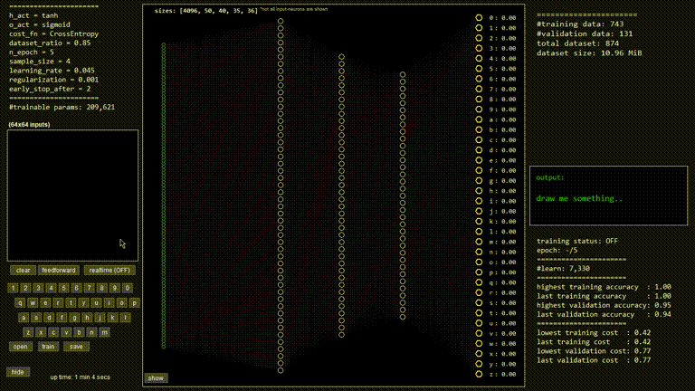
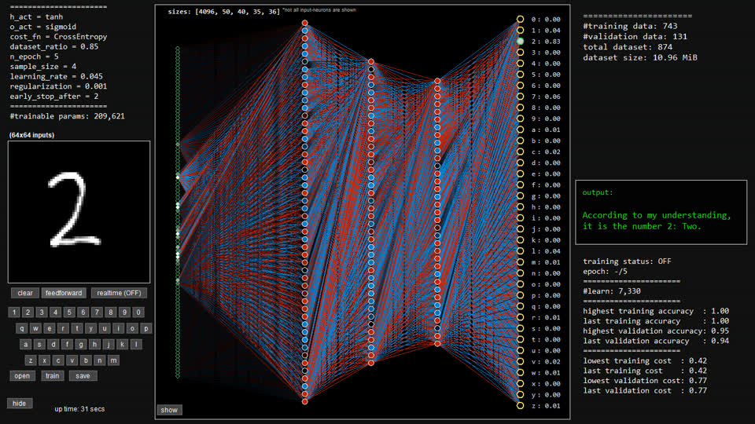
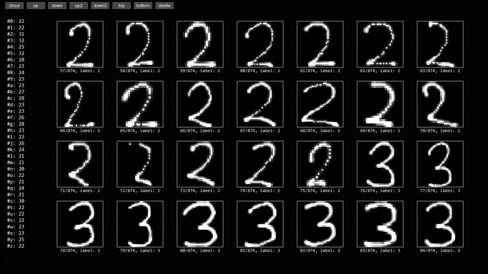
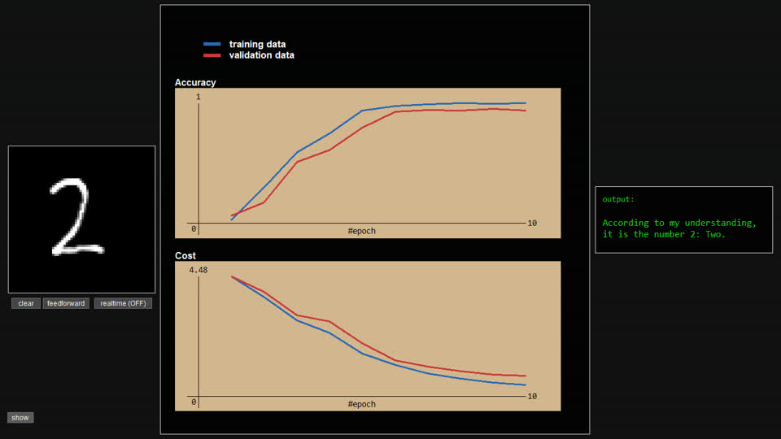

# Handwritten-Character-Recognition



Let's take a closer look at the appearance of a neural network. This software provides visualization of neural network diagrams, allowing us to observe the training process and create, save, and customize our own datasets. It offers full flexibility and customization options, with minimal dependencies, aiming to be as convenient as possible.

- **The main visual interface**

    

- **Dataset viewer**

    

- **Training the network**

    

> **[Demo video](https://youtu.be/GX0xBjiwgtg)**.


## Installation

1. Download this repository and save it to your machine (e.g. `~/code/Handwritten-Character-Recognition`)
2. Navigate to the folder where `Handwritten-Character-Recognition` is located, then run the following command:

    ```sh
    python Handwritten-Character-Recognition
    ```


## FAQ

- **To exit the application**: press the "esc" key

- **To reset the network**:

    Search for `NN_NEW` in `__main__.py` and set it to `True`. After you trained the network, press the button "save" to save it.

- **To reset the dataset**:

    Example: to reset the dataset of zero "0", replace the contents of the file `dataset/0.json` with an empty list `[]`.


## Troubleshoot

- If the `numpy` or `numba` module is missing, run the following command:

    ```sh
    pip install -r requirements.txt
    ```
- To report bugs/issues or ask questions, you can reach me [here](https://nvfp.github.io/contact) or open an issue/pull request.


## Changelog

- v1.0.1 (May 10, 2023):
    - Resolved bug: Renamed `carbon` to `carbon_plug` to prevent conflicts with the original `carbon` module (if installed).


## License

This project is licensed under the MIT license.
